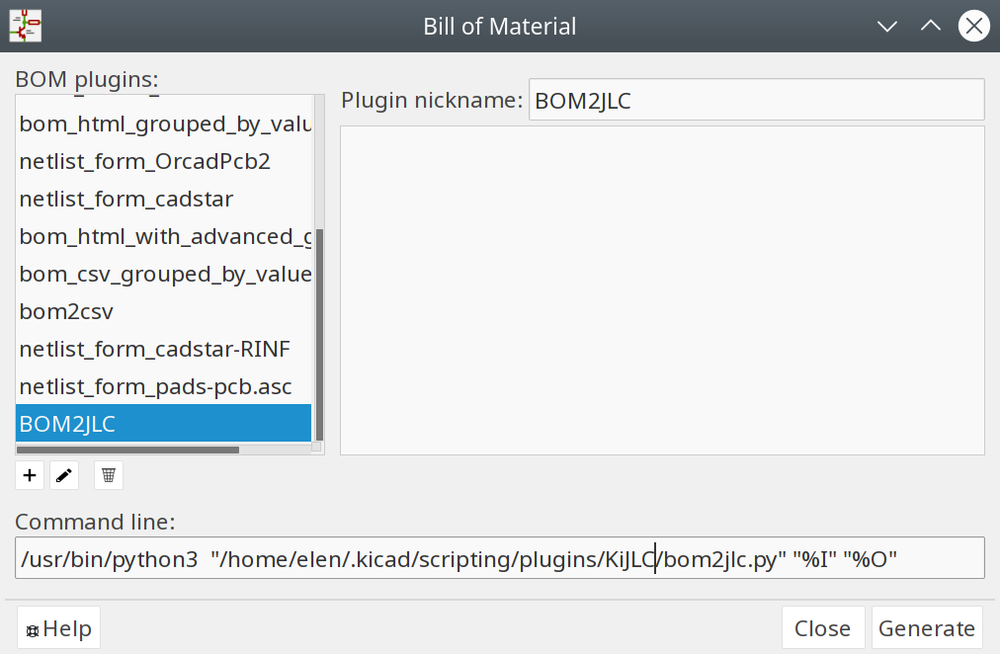

# KiJLC


An inofficial plugin for eeschema and pcbnew to export BOM and CPL files compliant with JLCSMT. We're not affiliated with JLC. Please double check your data as there might still be bugs.

## BOM Fields

Right now the BOM plugin expects two fields to be present: "JLC" which should contain the JLCSMT footprint specifier and "LCSC" which should contain the part number from LCSC.

Right now KiCad footprint specifiers are not being converted to JLC ones, but this could be implemented in the future.

## Installation

Clone the repo to `~/.kicad/scripting/plugins/KiJLC` and it will load the next time pcbnew is opened. Example:

```sh
mkdir -p ~/.kicad/scripting/plugins
cd ~/.kicad/scripting/plugins
git clone https://github.com/fullyautomated/KiJLC
```

For eeschema create a new BOM plugin entry under Tools->Generate Bill of Materials:



Command line:

```sh
/usr/bin/python3  "~/.kicad/scripting/plugins/KiJLC/bom2jlc.py" "%I" "%O"
```

## Usage

### pcbnew

Under Tools->External Plugins->Generate JLCSMT Placement Files
or via the button in the toolbar.

### eeschema

In the same configuration dialog as in Installation, just press generate and it will produce two BOM CSV files.
